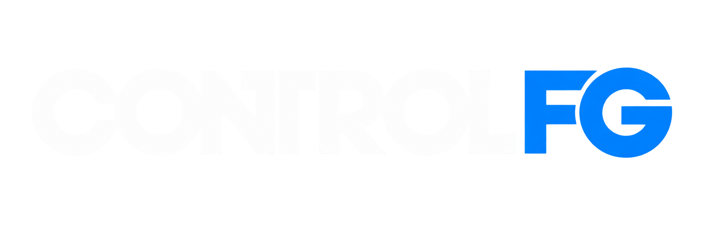
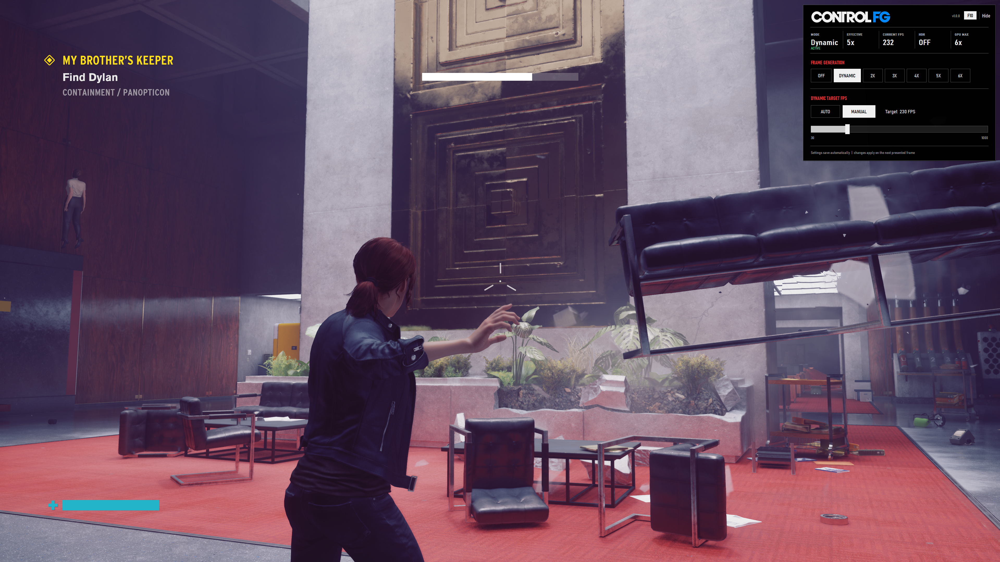
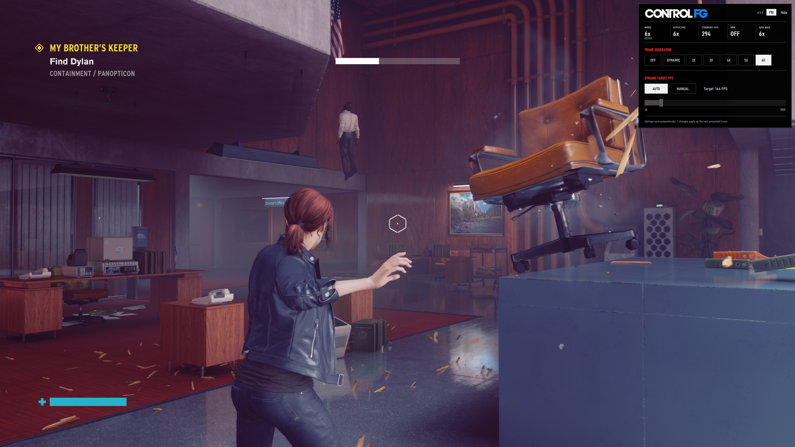
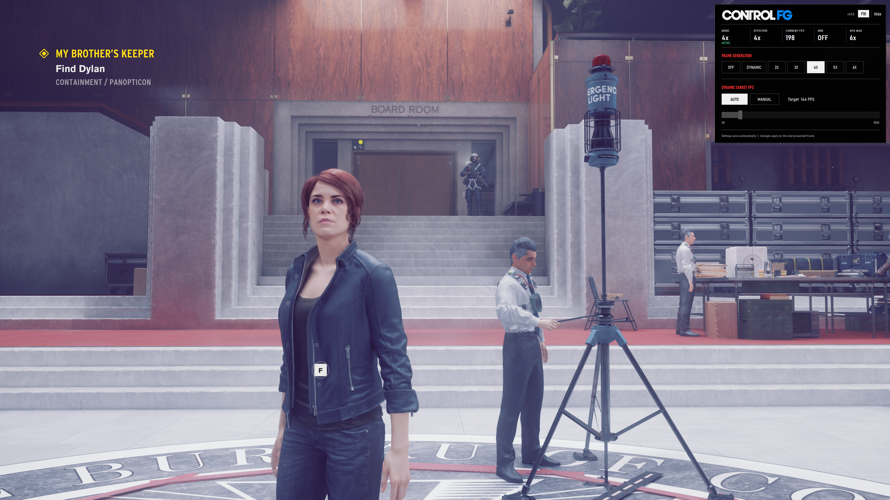
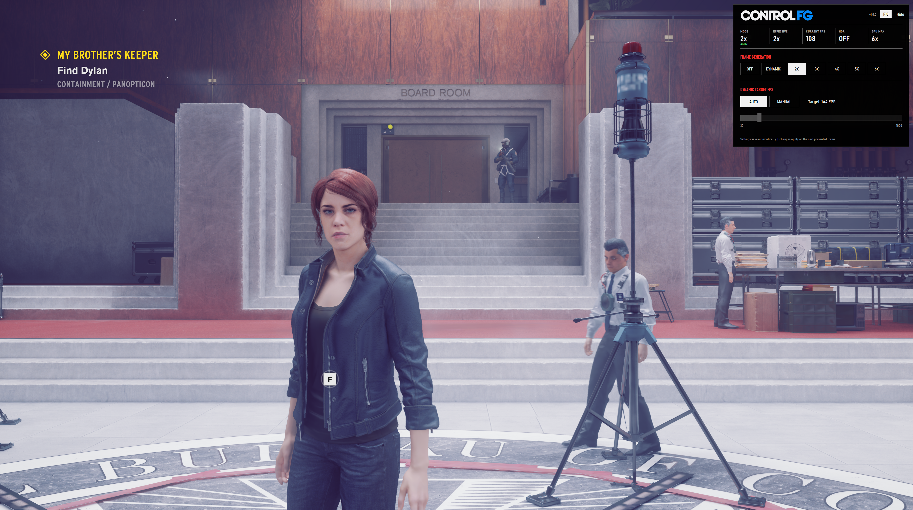

# Control FG

**Control FG** adds NVIDIA DLSS Frame Generation and DLSS Ray Reconstruction to the DirectX 12 version of Remedy Entertainment's *Control*, including fixed Frame Generation and Multi Frame Generation modes, native Dynamic Multi Frame Generation, live HDR handling, persistent settings, and an in-game overlay styled to fit Control's menu aesthetic.

Unlike a generic FG translation layer, Control FG is **game-specific and engine-aware**. *Control* does not expose a native Frame Generation integration for the mod to translate, so Control FG reconstructs the inputs FG needs directly from the game's renderer: frame boundaries, depth and motion-vector resources, camera data, jitter/reset state, pre-UI scene color, HDR state, and presentation timing. That makes the project less portable than broad compatibility tools, but allows a much deeper integration with *Control* itself.

> **Current release:** v2.0.0  
> **Verified game target:** Control on Steam, DX12, Steam build `21225456`  
> **Streamline:** NVIDIA Streamline `2.14.1`

## Video Demonstration

[Watch Control FG – App and Overlay Demonstration on YouTube](https://youtu.be/aP7UeCSx00c)

## Features

- **Off / 2x / 3x / 4x / 5x / 6x** fixed Frame Generation modes on supported hardware.
- **Native Dynamic MFG** with Auto monitor-refresh targeting or a manual 30–1000 FPS target.
- **DLSS Ray Reconstruction**, integrated directly into Control's native DX12 ray-tracing path and exposed through the in-game overlay.
- **Live HDR support**, including enabling/disabling HDR during gameplay without restarting the game. HDR/SDR transitions now perform a hard DLSS-G resource reset and clean rearm so Frame Generation does not carry stale presentation state across a Windows HDR mode change.
- **F10 overlay** that starts hidden and shows current mode, effective multiplier, output FPS, HDR state, and reported GPU maximum.
- **Persistent settings** stored in `%LOCALAPPDATA%\ControlFG\settings.ini`.
- **RTX 40-series safety policy:** Off and 2x are available; Dynamic and 3x–6x are disabled.
- Runtime-proven Dynamic MFG integration using Reflex pacing and the PCL `SimulationStart` marker required by the working path.
- **Game-aware HUD/UI handling:** Control FG captures a real pre-UI scene surface and recomposites the UI separately, preventing the HUD from being treated as moving world geometry by Frame Generation.

## DLSS Ray Reconstruction

Control FG v2.0.0 includes a working **DLSS Ray Reconstruction** path for Control's ray-traced renderer.

The implementation is game-specific rather than a generic post-process replacement. Control FG hooks the game's native ray-tracing/denoising boundary, disables the native denoiser for the RR path, and feeds Ray Reconstruction the renderer state it needs from Control itself: depth, motion vectors, camera/jitter data, ray-tracing resources, reset/discontinuity state, and the same presentation/HDR context used by the Frame Generation integration.

The current RR path uses the NVIDIA RR runtime `310.9.1`. Preset **F** is the default, with **E/F** selectable live from the overlay. RR is designed to coexist with Control's DLSS modes, ray tracing, HDR, and Frame Generation rather than running as an isolated screen-space filter.

Because the integration happens at Control's renderer boundary, RR replaces the game's native ray-tracing denoising stage instead of denoising an already-denoised final image. This is important for preserving the intended reconstruction inputs and avoiding a double-denoise path.

## Why Control FG is different

Tools such as universal upscaler/Frame Generation translators and ReShade-style add-ons are designed first for portability across many games. They typically work at a graphics/API interception layer and are strongest when a game already exposes the standardized resources and timing needed by an upscaler or Frame Generation API.

Control FG takes the opposite approach: it is **deeply integrated with one game's renderer**. Because *Control* shipped without a native FG source path, the mod identifies and reconstructs the data that a native implementation would normally provide, including:

- Control's actual renderer frame boundaries.
- Depth and motion-vector resources used by the game's existing DLSS path.
- Camera transform, field of view, jitter, and reset/discontinuity state.
- A genuine pre-UI / HUD-less scene surface.
- HDR state and presentation transitions.
- Game-specific synchronization and presentation behavior.

### Stable HUD and UI under Frame Generation

One of the biggest practical advantages of this game-specific approach is **HUD stability**. Control FG captures the full-resolution scene immediately before Control draws its HUD and UI, then supplies that HUD-less scene data to the Frame Generation backend. This keeps objective text, health/energy elements, prompts, icons, and menus from being interpreted as moving world geometry when the camera moves.

That is a fundamentally different approach from screen-space Frame Generation solutions such as Lossless Scaling, which only see the final composited image, and from generic injection paths such as OptiFG when a true HUD-less resource is not available. Generic solutions may need to infer or heuristically reconstruct the HUD-less image; Control FG has a build-locked renderer boundary where the actual pre-UI scene is available directly.

In current Control testing, this produces a notably stable HUD/UI during camera movement while still allowing the generated scene frames to interpolate normally.

This is not intended as a replacement for broad tools such as OptiScaler, ReShade, or Lossless Scaling. The design goals are different: those projects prioritize **wide compatibility and reusable interception**, while Control FG prioritizes **deep, game-aware integration** in a title that did not originally ship with Frame Generation.

The long-term architecture is being separated into a reusable FG backend layer and a game-specific semantic-capture layer. That makes it possible to investigate additional backends while preserving the higher-quality game data discovered specifically for *Control*.

## Hardware support

Control FG's current public release relies on NVIDIA DLSS Frame Generation support. On **GeForce RTX 40-series**, the mod intentionally exposes only **Off and 2x**. On hardware that reports Multi Frame Generation support, the overlay exposes modes up to the supported maximum, currently capped by the UI at **6x**, plus Dynamic MFG when the driver reports it available.

A current NVIDIA driver is strongly recommended. Hardware-accelerated GPU scheduling (HAGS) should be enabled if DLSS Frame Generation is unavailable on an otherwise supported system.

### Future RTX 20/30-series Frame Generation research

Support for **RTX 20-series (Turing)** and **RTX 30-series (Ampere)** Frame Generation / Multi Frame Generation is planned as a post-v2.0.0 research track. Recent community work has shown a path involving early architecture-gate handling plus GPU-specific DLSS-G backend/kernel support.

That work is intentionally **not part of v2.0.0**. The current release remains focused on the validated RTX 40/50-series path while future compatibility work is developed and tested separately. See [ROADMAP.md](ROADMAP.md).

## Install

For the prebuilt Nexus/GitHub release, see [INSTALL.md](INSTALL.md). The short version is: copy `dxgi.dll` and the `ControlFGStreamline` folder beside `Control_DX12.exe`, launch Control in DX12 mode, and press **F10**.

### ReShade / RenoDX compatibility

Control FG uses `dxgi.dll`, which can conflict with ReShade when ReShade is also installed under the same filename. **ReShade can be used alongside Control FG by renaming ReShade's `dxgi.dll` to `d3d12.dll`.**

Use this layout in the Control game directory:

- Keep **Control FG's** `dxgi.dll` named `dxgi.dll`.
- Rename **ReShade's** `dxgi.dll` to `d3d12.dll`.
- Leave the rest of the ReShade installation unchanged.

This allows Control FG and ReShade to load together without competing for the same `dxgi.dll` filename.

The same approach is expected to work with **RenoDX** configurations that use the same DXGI injection/loading method. RenoDX has not yet been fully validated across every configuration, so additional testing and feedback are welcome.

## Build from source

See [BUILDING.md](BUILDING.md). `Build.cmd` downloads and hash-verifies the pinned official Streamline 2.14.1 SDK, compiles the x64 DXGI proxy, runs ABI/export/smoke checks, and creates the release ZIPs.

## Screenshots

### Dynamic Multi Frame Generation

Dynamic Multi Frame Generation automatically adjusts the generated-frame count toward your target output FPS.

### Fixed 6× Multi Frame Generation

Up to 6× Multi Frame Generation on supported hardware.

### Fixed 4× Multi Frame Generation

Selectable fixed multipliers from 2× through 6×.

### RTX 40-Series Compatible 2×

GeForce RTX 40-series GPUs are intentionally limited to Off and 2×.

## Troubleshooting

See [TROUBLESHOOTING.md](TROUBLESHOOTING.md). The most common issues are launching the DX11 executable, using an unsupported game build, an outdated NVIDIA driver/HAGS configuration, or a second wrapper competing for `dxgi.dll`. For ReShade, use the `d3d12.dll` rename described in the compatibility section above.

## Current compatibility

This release is **build-locked to the Steam DX12 version listed above**. GOG/Epic builds and later Control patches are not claimed compatible until tested. ReShade can be used alongside Control FG with the loader rename described above. RenoDX is expected to work through the same approach when using the same DXGI injection method, but has not yet been fully validated across configurations.

## Project status / roadmap

Frame Generation and Ray Reconstruction are now both part of the v2.0.0 release. The next major development target is **DLSS 5 integration**, followed by additional GPU compatibility research including RTX 20/30-series Frame Generation and Multi Frame Generation. See [ROADMAP.md](ROADMAP.md).

## Credits and legal

Control FG is an unofficial fan-made mod and is not affiliated with or endorsed by Remedy Entertainment, 505 Games, NVIDIA, AMD, Valve, OptiScaler, ReShade, or Lossless Scaling. *Control* and its trademarks/assets belong to their respective owners. NVIDIA Streamline is redistributed under its upstream license; see [legal/STREAMLINE-LICENSE.txt](legal/STREAMLINE-LICENSE.txt) and [legal/THIRD-PARTY-NOTICES.md](legal/THIRD-PARTY-NOTICES.md).

No project-wide open-source license has been selected for Control FG yet. Until one is added by the project owner, normal copyright rules apply to the original Control FG source code.
